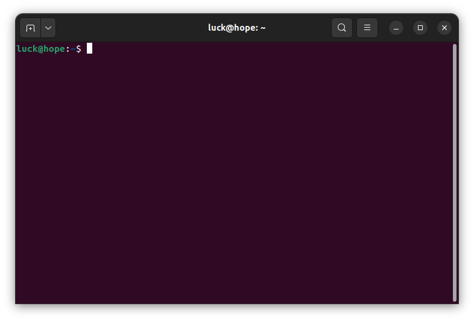
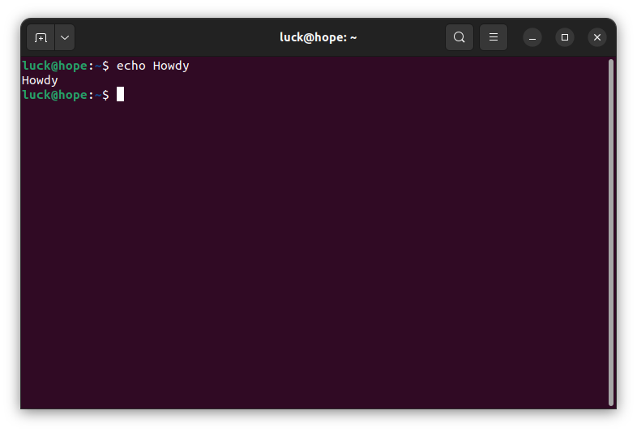
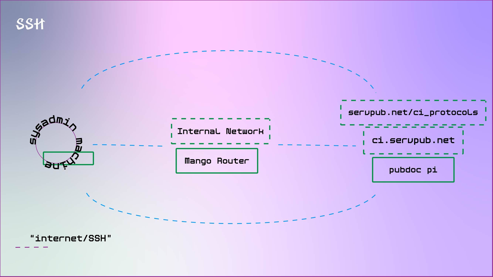
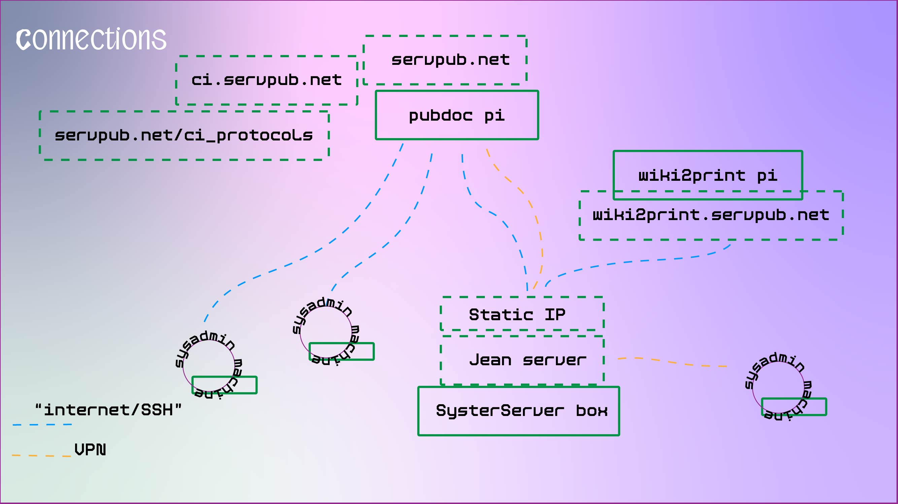
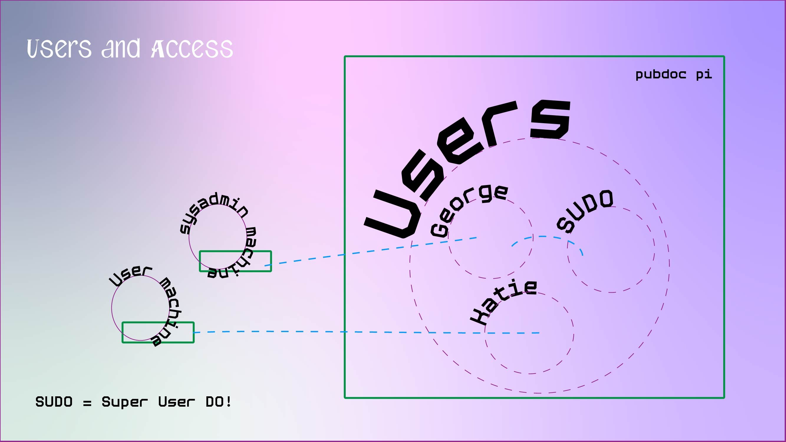
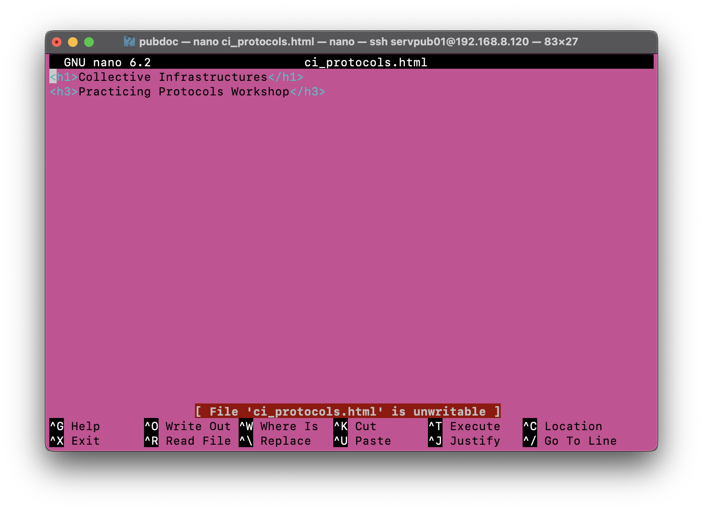

<style>
	code.nginx{ 
		font-size: 0.4em!important; 
		line-height: 1.5em!important; 
	} 
	table{ 
		font-size: 0.5em!important; 
		margin: 40px 0!important;
		color:beige!important;
	}
    
	.tiny-font{
		font-size: 0.5em;
	}
	.markdown-preview-view code{
	         font-size: 0.5em;
	}
	
	pre{
	     font-size: 0.7em!important;
	}
	ul,
	p{
		font-family: 
		"Arial"!important;
		font-size: 0.8em!important;
		color:beige!important;
	}
	h1,h2,h3{
        font-family : "Courier"!important;
        font-size: 1.5em!important;
        color: coral!important;
}
	code{
	     padding: 0.5em 1em!important;
	}
.slide-background{
background: rgb(79,9,121); background: linear-gradient(180deg, rgba(79,9,121,1) 4%, rgba(52,1,45,1) 100%)!important;

}
</style>

<!-- .slide: class="bg" -->

# Collective Infrastructures Panel
#### Practicing Protocols workshop

Please login to this wifi network: GL-MT300N-V2-cf0

PW: goodlife

---
# Intro In-grid
In-grid is a trans\*feminist collective of artists/educators/technologists working in and around digital infrastructures. In-grid has been working together since 2019, and is made up of a fluid group of people dispersed globally.


---
# Combined Panel

This combined panel takes a critical look at digital "cloud" infrastructures. It explores how collectives and communities counter these centralised models through their situated relations, methods and technical practices. 

The __Combined Panel__ takes the form of:
- A Panel
- A workshop <-- We are here
- A Hosted Blog <-- We will be posting to here

---
# Panel

For the panel we brought together a range of researchers and practitioners. Each panellist shared their nuanced context and how their collectives\*communities are making transformations in infrastructures. We did this to see how system admins and community organisers are forming a diversity of nuanced and situated protocols and ways of collaborating otherwise.

---

# Workshop Outline <-- ( we are here )

Today's workshop aims to bring together the combined panel's conceptual elements with material socio-technical practice. In this session we will enact the creation of a speculative set of protocols that aim to question the relational complexities of editing, updating and maintaining a collective server, and learning some basic technical skills along the way!

The end goal is to have collectively edited set of protocols that we publish to an html page on the server.

---
# Blog <-- ( we will be posting to here )

The blog element aims to extend conversation from the panel through our own federated infrastructure, subverting and hacking the hierarchies of this conference. It brings this research together in a space that can sit both inside/outside\*beyond the conference.

Access it at: [ci.servpub.net](https//:ci.servpub.net)

---
# Protocols
We will also be making and editing a set of protocols as we work through the steps of this workshop. 

The protocols will be hosted on an html file on the server, and is accessible at this URL page: https://servpub.net/ci_protocols.html

---
# What are these protocols?

When it comes to making collaborative community driven sociotechnical infrastructure, there is always a complex network of relations that we have to work through. Negotiating every relation when we enter a space could be very complex and time consuming, as we will see, but setting protocols helps us firm up ways of working and relational conventions that ease this flow. Through setting these protocols together we mean to disobey the norms of network infrastructures and actively re-scope how we come to these systems and relations together.

---

#### Diagram: of socio-technical relations of Servpub project 


---
# 1. Intro terminal software


Lets give a little context of working with computers

---

### GUI



So most people are probably used to working through a **graphical user interface** (GUI), which is a relatively recent way of interfacing with a computer. This is great for accessibility but also tends to scope and direct the abilities and capacities you have on your computer, as in there are only so many buttons or things you can show in a communicable way. 

---
### Terminal



Terminal is a more classic way of working with a machine, and roughly speaking is the step between punch-card/magnetic tape style computing and a GUI. It is a very simple but powerful interface that lets you run basically any command on your system through a text interface. Compared to a GUI this space is more "risky" as you can do anything from anywhere, such as deleting the entire hard disc (not advised). It also means that there are no limitations to your system administration so you have access to a granular level of working. 

---

## Protocols

When entering into this more "risky" space on a computer network, it is good to set some intentions and work out how to move through this space with care. As we go though these next steps getting into terminal have a think about what it means to be in this place of power/risk, and what relations you think you need to care for and form protocols for?

It can also be a great place to think about if/how your system let's you into this place of power, and what relations this empowering brings with it. 

---

# 2. Accessing Terminal 

This depends on your platform, so...

---

## Mac & Linux

On a Mac it is already installed! So all you need to do is:
1. Search up Terminal
2. Open it!
---
## Windows

There are similar programs to terminal already installed, but not the same language (bash), so the easiest way to get going is:
1. Install git Bash from [HERE](https://github.com/git-for-windows/git/releases/tag/v2.44.0.windows.1)
2. Then open it up!

---
# 3. Intro to Terminal Commands

As we said before terminal is a text/syntax-based way of interfacing your machine and we are going to introduce a few basic commands and concepts to get us going today.

---
## Say Hi!

Let's simply use `echo` to get our terminal to say HI!.

To do this use:
``` bash
echo <message>
```

e.g.
``` bash
echo HI!
```

---
## Who are you?

Now lets see who your computer!

Show the name of the currently logged in user:

```shell
whoami
```

Show the name of the machine is given on the network:

```shell
hostname
```

---
## Structure + Navigation

Much of working on the command line involves navigating around your system without the use of a Graphical User Interface (GUI).

However, we will essentially be navigating around normal computer folder hierarchies like below:

```
root/
├─ directoryname/
       ├─ anotherdirectory/
                  ├─ aFileName.txt
```

---

**Directory** : also known as a folder

Print working directory that you are currently in:

```shell
pwd
```

List current directory contents:

```shell
ls
```

---
## Moving around

Now to move between directories/folders we use `cd`  like so

``` bash
cd <directory_name>
```

e.g.
``` bash
cd folder1
```


>We can use a folder that was shown with `ls` in the last step!
>You can also check whats in the new folder with `ls` to see that you have moved.

---

## Writing Terminal Protocols

> [!question] Prompt
> In this unfamiliar space how do we keep track of where we are, what we've done & what commands we may need in the future?
> ...or any other concerns!

---
# 3. Intro to SSH

Secure Shell (SSH) is a way of working on another machine from your own, working in their shell (bash). 

It basically lets you work on another computers terminal remotely. This is the way you will work on most servers or remote/faceless computers (computers without a screen).

---

## SSH Protocol


---
The SSH protocol enables us to talk securely to our server by encrypting and authenticating all of our communication/interfacing through the network. 

Traditionally tech has a metaphor of SSH as a secure hand shake protocol, but it will be great to think about what metaphor or relation we want when it comes to crossing boundaries and spaces. 

Do we want to hand shake or do we think . . . would enable . . . 

---

## Installing SSH

Again this may be a bit different on different systems, as some will have this already installed and some will need to install it. 

if you are on **Mac** or **Linux** you may need to install it with:

``` shell
sudo apt install openssh-client
```

If you are on gitbash on windows, it should be installed.

---

## Getting the IP address of the pi

To SSH into the pi we need to know what the IP address of the pi is. 

An IP address is basically the postcode/address we will find the pi at on the network.

To do this on the pi we write:

```shell
hostname -I
```

This will print out something like `192.168.0.8`, and we need to save this to SSH into the pi

---

## SSH into the pi

Now that we have the IP address, any computer on that network can request to SSH into the Pi through these commands:
``` shell
ssh <user_name>@<ip>
```
eg.
``` shell
ssh ci@192.168.8.120
```

You are now "logging into" the pi, so it will ask for the password here and that is `iloveinfra`

> [!question] Prompt
> Input password to pi user

---
## Are we in there?

You should now see your terminal username change from your laptop's local user to something like: 

``` shell
ci@servpub~$.
```

If you want to exit out of the pi (we don't atm) type:

``` shell
exit
```

Hit enter. You will need to have exited the pi before setting up your ssh key. 

---
## Secure SSH keys

We won't do it here as it takes a minute too long, but to do this securely we would set up a set of keys which, one private and one public, that will do the "hand shake" instead of a less secure password. 

---
## Writing SSH protocols

> [!question] Prompt
> How do we navigate another machine through our own "interface"?
> What are the relational agreements to being on this other machine?

---
# 4. Intro to shared server

Caring for a server includes routine tasks like updating/upgrading the system software, tiding up files, creating new users & giving access permissions, paying attention to errors and bug reports.

Sharing a server space presents the added complexity of doing all of the above with consideration other collectives' and/or groups' pre-existing protocols (eg. Systerserver)

---



---
# 5. Entering into sudo

Sudo enables us to take on a **superuser role**.
This means that we have all the security permissions for that system. This is a "very risky" role, as here you can do anything on the server/computer. With sudo you can actually delete the entire system or make other similar drastic commands, but it also means that we have the ability to manage and configure our system to our needs.

When we come to writing protocols for sudo, what does it mean for us to be a "superuser" or an admin, and what care and consideration should we take on in these protocols?

---


---
## Becoming sudo

To become sudo you just need to:
``` shell
sudo su
```

And then enter the password when prompted.

---
## Writing sudo protocols

> [!question] Prompt
> Super User can Do! a lot... what permissions are we comfortable navigating?
> How intimate are we with our machines?

---
# 6. Intro to Tmux 

Tmux is what is called a multiplexer, which is a software that lets us collectively work one terminal session. 

This is how many collectives and collaborative networks work together on servers in one space. It lets us edit and run commands in one space and take responsibility and practice our infra becoming together.

When we come to writing protocols we might want to think about what it means to be one user together, and how can we keep everyone at the same pace and comfortable levels of understanding. 

---

## Making a collective session

Now we are all `sudo` we can initiate a shared session to work in together.

To do this we use:
```shell
tmux new -s <name>
```

Now we need to name our collective space. If we think back\*forward in this workshop, what are the intentions, dynamics and relations we want to collectively name this space with?

---
# Joining our session

Now we have an active session we can join it by just typing:
``` shell
tmux a -t <name>
```

> Rember we have to be sudo to join this!

---
## Saying hi to each other!

Now we can say hi to one another and say cute messages in the space by:
``` shell
echo <message>
```

Say something to welcome each other into this session, you may need to take turns.

---
## Collective working

As we saw even each of us writing an echo command takes a little bit of choreographing. When this gets more complicated, like writing complex configuration files, you can imagine it gets even more tricky.

So here we need to think about how we might manage collective editing. What operational metaphor might we use to describe the relationship between the person typing and the others? Who and how do we choose to type? How do we take care of every voice in that conversation?

---
# 7. Collectively editing

We've created a simple html document to edit. We need to navigate to that file, open and edit it. 

First lets navigate to the folder its inside and list its contents.

``` shell
cd /var/www/pubdoc
ls
```

We should see a file called:

`ci_protocols.html`


---
## Editing the HTML

Now we are in the right folder we can edit the file with **nano** which is a terminal base text editor. 

To open the file with **nano** we do:
``` shell
nano ci_protocols.html
```

This will open the file in the terminal.

---
### This should look something like this



> [!tip] 
> Being terminal you have to navigate with the keyboard, and also copy and past by right clicking (not "CNTRL+C/P")

---
## Adding to the file

From here we can then add text and images using basic HTML syntax.

For the time being we are going to just add fun bits to see it work, as we have some more protocols to write and add.

So for now add a message or paste in some ascii art with the help of these links:

[ascii text gen](http://www.patorjk.com/software/taag/)

[ascii image gen](https://www.ascii-art-generator.org/)

> [!tip] Remember to paste in with a right click!

---
## Seeing our page!

Now if we return to the file online at:

https://servpub.net/ci_protocols.html

we will see our beautiful inputs.

---
## Do we want to edit or change the Collective editing protocols?


---
# 8. Exit safely 

When we finish up working together there are lots of things we can do to make it easier to return to our work, make it legible to others, as well as caring for the infrastructure we're working in. This could include careful documentation, understanding how to save and record edits, and exiting programs in their nuanced ways.

---
### Exiting Tmux

We've finished working together and now we would like to leave our TMUX session. This is a little more complex than it might appear. Leaving a session using an 'exit' command will delete the session for others, and you will lose the record of your edits together. Instead we can either:

Close the entire terminal session window, or use Ctrl-b. This will retain the terminal session for you to use again in the future. 

---
# Exiting safely

Let's consider collectively how to ensure we exit safely, using a door rather than an ejector seat. How does this action differ from exiting other softwares and how does this attention affect our relationships.

---

### Writing the protocols

> [!question] prompt
> How do we negotiate the space of working collectively as one user?
> What other considerations need to be voiced?

---
# 9. Publish protocols

Now we have all the protocols ready lets add them to the HTML file with **nano** again.

Once we have edited the HTML, we can launch our page in a browser! 

At https://servpub.net/ci_protocols.html 

---

# We did it!

Practising infrastructuring collectively can be (intentionally) a slow, careful and unscalable process, so it's important to acknowledge our incremental changes, achievements and presence. 

---
### Reflections

---
### Resources for maintainable practices

Our (ongoing) documentation https://github.com/In-grid-collective/servPubWiki.git